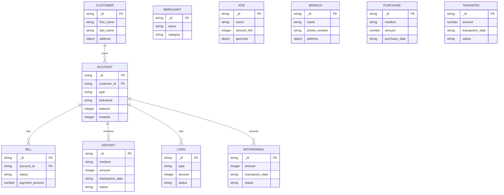

# Nessie API reference for the hackathon

This is an integration reference for the temporary Nessie dependency used by
this project. Nessie is not the project's final backend.

For a browser-friendly version of this full reference, open
[Nessie API reference](nessie-api-reference.html). The relationship explorer is
available separately at [Nessie ER diagram](nessie-er-diagram.html).

**Source and scope.** This document was transcribed from Nessie's published
OpenAPI 3.0.3 specification, version `1.0.0`, downloaded on 2026-09-11 from
`https://prod.nessieisreal.com/nessie-openapi-spec.yaml`. The interactive
documentation is at <https://prod.nessieisreal.com/docs>. Re-check the source
before depending on a behavior in production.

**Runtime spot check (2026-09-11).** Read-only calls with an authorized test
key returned `200` for all eight tested collection endpoints: customers,
accounts, deposits, merchants, ATMs, branches, enterprise customers, and
enterprise deposits. Before mutation testing, the test key's own customers,
accounts, deposits, and merchants were empty.

**Mutation lifecycle check (2026-09-11).** With an explicitly marked dummy
customer, the API successfully created and updated a customer and account,
then created, updated, and deleted one bill, deposit, loan, and withdrawal.
The dependent records subsequently returned `404`, and the customer's account
list was empty after the account deletion. No enterprise resource was changed.
The customer could not be deleted; it remains as an intentionally marked
orphan dummy record because the production route is not deployed.

**Actual successful mutation response shape.** Contrary to the published spec,
the tested `201` and `202` responses were JSON objects, not strings. Create
responses contained `code`, `message`, and `objectCreated`; update responses
contained `code`, `message`, and `objectUpdated`. The ID can be read from the
`_id` property inside the created object. Bill and withdrawal deletion returned
a JSON string; deposit, loan, and account deletion returned an empty body.

**Purchase and transfer update check (2026-09-11).** `PUT` is not an upsert
for either resource. Requests using new UUIDs and bodies that passed request
validation both returned `404` (`Purchase with this id does not exist` and
`This id does not exist in transfers`). The tested valid candidate fields were
`medium`, `purchase_date`, `amount`, and `description` for a purchase, and
`transaction_date`, `amount`, `status`, and `description` for a transfer.
For the tested purchase update, `merchant_id` and `status` were rejected as
extra fields; for the tested transfer update, `medium` and `payee_id` were
rejected as extra fields. This is partial validation evidence, not a complete
schema.

**ATM and account-owner checks (2026-09-11).** `GET /atms/{id}` returned
`200` with `_id`, `name`, `geocode`, `hours`, `accessibility`,
`language_list`, and `amount_left`. `GET /accounts/{id}/customer` returned
`200` with a Customer object (`_id`, `first_name`, `last_name`, and
`address`), rather than the JSON string stated in the published specification.
A temporary account was created under the existing marked dummy customer for
this check and deleted successfully afterward.

**Deletion check (2026-09-11).** `DELETE` requests with an authorized key and
nonexistent sentinel IDs to `/customers/{id}` and `/merchants/{id}` both
returned `403` with `"Missing Authentication Token"`. This confirms neither
delete route is deployed at the production base URL; it is therefore not safe
to create temporary customer or merchant records expecting to clean them up.

## Connection and authentication

Use `https://prod-api.nessieisreal.com` as the production base URL. The
specification also lists local, QA, and direct-QA servers; this reference does
not recommend those environments for the hackathon.

Every operation below requires the query parameter `key` (string), as well as
the API-key security scheme. Do not commit an API key or put it in a client
bundle. A request therefore has this shape:

```http
GET /customers?key=<NESSIE_API_KEY>
Accept: application/json
```

All write bodies are `application/json`. The specification does not define a
single uniform error envelope: `400` and `404` usually use `Error`, while
`401` is documented as a JSON string. Successful create/update operations are
often documented as a JSON string rather than the created object.

## Resource relationships

```text
Customer
  |-- Account (created at /customers/{customerId}/accounts)
        |-- Bill
        |-- Deposit
        |-- Loan
        `-- Withdrawal

Merchant, ATM, and Branch are directory resources.
Purchase and Transfer exist as individual transaction resources in this
specification, but it does not define account-scoped list/create endpoints or
schemas for them.
```

Use the customer-scoped paths to enumerate a customer's accounts and bills;
use account-scoped paths to enumerate or create bills, deposits, loans, and
withdrawals. Although the published specification says
`GET /accounts/{id}/customer` returns a JSON string, runtime validation
confirmed that it returns the `Customer` object shape.

## Entity-relationship diagram

For an interactive, higher-detail view, open
[the ER diagram page](nessie-er-diagram.html). The Mermaid version remains
below for rendering in Markdown-native tools.

Solid relationships below are confirmed by the available nested endpoints and
runtime checks. Directory resources are intentionally isolated. Purchases and
transfers are also isolated because the published API does not expose enough
creation/listing contract to establish their foreign-key relationships.



`account_id` is a declared field of `Bill`; the other account-to-transaction
links are represented by their account-scoped endpoints and are not declared
foreign-key fields in the published schemas. All IDs must be handled as opaque
strings: live responses used UUIDs despite several OpenAPI schemas declaring
24-character IDs.

## Endpoint catalog

Path placeholders (`{id}`, `{billId}`, etc.) are required path strings. Add
`?key=<apiKey>` to every request. `Error` refers to the schema in the shared
models section. A blank response body is explicitly noted where the spec does
not declare one.

### Customers

| Method | Path | Body | Successful response | Error responses |
| --- | --- | --- | --- | --- |
| GET | `/customers` | — | `200 Customer[]` | `401 string` |
| POST | `/customers` | `CustomerCreate` | `201 string` | `400 Error`, `401 string` |
| GET | `/customers/{id}` | — | `200 Customer` | `404 Error`, `401 string` |
| PUT | `/customers/{id}` | `CustomerUpdate` | `202 string` | `400 Error`, `404 Error`, `401 string` |
| GET | `/customers/{id}/accounts` | — | `200 Account[]` | `400 Error`, `401 string` |
| POST | `/customers/{id}/accounts` | `AccountCreate` | `201 string` | `400 Error`, `401 string` |
| GET | `/customers/{id}/bills` | — | `200 Bill[]` | `400 Error`, `401 string` |

### Accounts

| Method | Path | Body | Successful response | Error responses |
| --- | --- | --- | --- | --- |
| GET | `/accounts` | — | `200 Account[]` | `400 Error`, `401 string` |
| GET | `/accounts/{id}` | — | `200 Account` | `400 Error`, `404 Error`, `401 string` |
| PUT | `/accounts/{id}` | `AccountUpdate` | `202 string` | `400 Error`, `404 Error`, `401 string` |
| DELETE | `/accounts/{id}` | — | `200`, no body declared | `401 string` |
| GET | `/accounts/{id}/customer` | — | `200 Customer` (runtime-verified; spec says `string`) | `401 string` |
| GET | `/accounts/{id}/bills` | — | `200 Bill[]` | `400 Error`, `401 string` |
| POST | `/accounts/{id}/bills` | `BillCreate` | `201 string` | `400 Error`, `401 string` |
| GET | `/accounts/{id}/deposits` | — | `200 Deposit[]` | `400 Error`, `401 string` |
| POST | `/accounts/{id}/deposits` | `DepositCreate` | `201 string` | `400 Error`, `401 string` |
| GET | `/accounts/{id}/loans` | — | `200 Loan[]` | `400 Error`, `401 string` |
| POST | `/accounts/{id}/loans` | `LoanCreate` | `201 string` | `400 Error`, `401 string` |
| GET | `/accounts/{id}/withdrawals` | — | `200 object[]` (inline, unspecified fields) | `400 Error`, `401 string` |
| POST | `/accounts/{id}/withdrawals` | inline object, unspecified fields | `201 string` | `400 Error`, `401 string` |

### Bills, deposits, and loans

| Method | Path | Body | Successful response | Error responses |
| --- | --- | --- | --- | --- |
| GET | `/bills/{billId}` | — | `200 Bill` | `400 Error`, `404 Error`, `401 string` |
| PUT | `/bills/{billId}` | `BillUpdate` | `202 string` | `400 Error`, `404 Error`, `401 string` |
| DELETE | `/bills/{billId}` | — | `200 string` | `401 string` |
| GET | `/deposits` | — | `200 Deposit[]` | `400 Error`, `401 string` |
| GET | `/deposits/{id}` | — | `200 Deposit` | `400 Error`, `404 Error`, `401 string` |
| PUT | `/deposits/{id}` | `DepositUpdate` | `202 string` | `400 Error`, `404 Error`, `401 string` |
| DELETE | `/deposits/{id}` | — | `200`, no body declared | `401 string` |
| GET | `/loans/{id}` | — | `200 Loan` | `400 Error`, `404 Error`, `401 string` |
| PUT | `/loans/{id}` | `LoanUpdate` | `202 string` | `400 Error`, `404 Error`, `401 string` |
| DELETE | `/loans/{id}` | — | `200`, no body declared | `401 string` |

### Merchants, ATMs, and branches

| Method | Path | Body | Successful response | Error responses |
| --- | --- | --- | --- | --- |
| GET | `/merchants` | — | `200 Merchant[]` | `400 Error`, `401 string` |
| POST | `/merchants` | `MerchantCreate` | `201 string` | `400 Error`, `401 string` |
| GET | `/merchants/{id}` | — | `200 Merchant` | `400 Error`, `404 Error`, `401 string` |
| PUT | `/merchants/{id}` | `MerchantUpdate` | `202 string` | `400 Error`, `404 Error`, `401 string` |
| GET | `/atms` | — | `200 ATM[]` | `400 Error`, `401 string` |
| GET | `/atms/{id}` | — | `200 ATM` | `400 Error`, `404 Error`, `401 string` |
| GET | `/branches` | — | `200 Branch[]` | `400 Error`, `401 string` |
| GET | `/branches/{id}` | — | `200 Branch` | `400 Error`, `404 Error`, `401 string` |

`ATM` is referenced by the endpoint responses but is absent from the published
`components.schemas` section. Runtime validation observed these fields:
`_id`, `name`, `geocode`, `hours`, `accessibility`, `language_list`, and
`amount_left`. Treat their inner array/object element shapes as unverified.

### Enterprise reads

| Method | Path | Body | Successful response | Error responses |
| --- | --- | --- | --- | --- |
| GET | `/enterprise/customers` | — | `200 Customer[]` | `401 string` |
| GET | `/enterprise/customers/{customer_id}` | — | `200 Customer` | `404 Error`, `401 string` |
| GET | `/enterprise/deposits` | — | `200 Deposit[]` | `401 string` |
| GET | `/enterprise/deposits/{deposit_id}` | — | `200 Deposit` | `404 Error`, `401 string` |
| GET | `/enterprise/withdrawal/{withdrawal_id}` | — | `200 object`, unspecified fields | `404 Error`, `401 string` |

### Purchases, transfers, and withdrawals

| Method | Path | Body | Successful response | Error responses |
| --- | --- | --- | --- | --- |
| GET | `/purchase/{purchase_id}` | — | `200 object`, unspecified fields | `404 Error`, `401 string` |
| PUT | `/purchase/{purchase_id}` | inline object, unspecified fields | `202 string` | `400 Error`, `404 Error`, `401 string` |
| DELETE | `/purchase/{purchase_id}` | — | `200`, no body declared | `401 string` |
| GET | `/transfers/{transfer_id}` | — | `200 object`, unspecified fields | `404 Error`, `401 string` |
| PUT | `/transfers/{transfer_id}` | inline object, unspecified fields | `202 string` | `400 Error`, `404 Error`, `401 string` |
| DELETE | `/transfers/{transfer_id}` | — | `200`, no body declared | `401 string` |
| GET | `/withdrawal/{withdrawal_id}` | — | `200 object`, unspecified fields | `404 Error`, `401 string` |
| PUT | `/withdrawal/{withdrawal_id}` | inline object, unspecified fields | `202 string` | `400 Error`, `404 Error`, `401 string` |
| DELETE | `/withdrawal/{withdrawal_id}` | — | `200`, no body declared | `401 string` |

The specification defines no property for the inline purchase, transfer, or
withdrawal request/response objects. Treat those payloads as untyped until
validated with an authorized integration test; do not invent fields from older
versions of Nessie.

## Shared models and request bodies

`*` marks a required field in that schema. The OpenAPI schema declares IDs on
returned `Customer`, `Account`, `Bill`, `Merchant`, `Branch`, `Deposit`, and
`Loan` models as 24-character strings. **TODO: Verify:** live enterprise
customer and deposit IDs observed on 2026-09-11 were UUID-formatted strings,
so client IDs must be treated as opaque strings rather than validated as
24-character values.

### Common objects

| Model | Fields |
| --- | --- |
| `Error` | `code?: integer`, `message?: string`, `details?: string` |
| `Address` | `street_number*: string`, `street_name*: string`, `city*: string`, `state*: string`, `zip*: string` |
| `Geocode` | `lat*: number (float)`, `lng*: number (float)` |
| `AccountType` | enum: `Credit Card`, `Savings`, `Checking` |
| `BillStatus` | enum: `pending`, `cancelled`, `completed`, `recurring` |

### Customer and account bodies

| Body/model | Fields |
| --- | --- |
| `CustomerCreate` | `first_name*: string`, `last_name*: string`, `address*: Address` |
| `CustomerUpdate` | `first_name?: string`, `last_name?: string`, `address?: Address` |
| `Customer` | `_id*: string`, plus the three `CustomerCreate` fields |
| `AccountCreate` | `type*: AccountType`, `nickname*: string`, `rewards*: integer >= 0`, `balance*: integer >= 0` |
| `AccountUpdate` | `nickname*: string` |
| `Account` | `_id*: string`, all `AccountCreate` fields, `account_number*: string (16 chars)`, `customer_id*: string` |

### Bill bodies

| Body/model | Fields |
| --- | --- |
| `BillCreate` | `status*: BillStatus`, `payee*: string`, `payment_amount*: number (float)`, `nickname?: string`, `payment_date?: string`, `recurring_date?: integer 1..31` |
| `BillUpdate` | same fields as `BillCreate`, all optional |
| `Bill` | `_id*: string`, `status*: BillStatus`, `payee*: string`, `nickname*: string`, `creation_date*: string (date)`, `payment_date*: string`, `recurring_date*: integer 1..31`, `upcoming_payment_date*: string`, `payment_amount*: number (float)`, `account_id*: string` |

### Deposit and loan bodies

| Body/model | Fields |
| --- | --- |
| `DepositCreate` | `medium*: string`, `transaction_date*: string`, `status*: string`, `amount*: integer`, `description*: string` |
| `DepositUpdate` | same fields as `DepositCreate`, all optional |
| `Deposit` | `_id*: string`, plus all `DepositCreate` fields |
| `LoanCreate` | `type*: string`, `status*: string`, `credit_score*: integer`, `monthly_payment*: integer`, `amount*: integer`, `description*: string` |
| `LoanUpdate` | same fields as `LoanCreate`, all optional |
| `Loan` | `_id*: string`, `creation_date*: string (date)`, plus all `LoanCreate` fields |

### Merchant and directory models

| Body/model | Fields |
| --- | --- |
| `MerchantCreate` | `name*: string`, `category?: string`, `address?: Address`, `geocode?: Geocode` |
| `MerchantUpdate` | `name?: string`, `category?: string`, `address?: Address`, `geocode?: Geocode` |
| `Merchant` | `_id*: string`, `name*: string`, `category?: string`, `address?: Address`, `geocode?: Geocode` |
| `Branch` | `_id*: string`, `name*: string`, `phone_number*: string`, `hours*: string[]`, `notes*: string[]`, `address*: Address` |

## Minimal request examples

Create a customer, then an account belonging to that customer:

```bash
curl --request POST 'https://prod-api.nessieisreal.com/customers?key=<NESSIE_API_KEY>' \
  --header 'Content-Type: application/json' \
  --data '{
    "first_name": "Jane",
    "last_name": "Doe",
    "address": {
      "street_number": "1",
      "street_name": "Main St",
      "city": "Arlington",
      "state": "VA",
      "zip": "22201"
    }
  }'

curl --request POST 'https://prod-api.nessieisreal.com/customers/<CUSTOMER_ID>/accounts?key=<NESSIE_API_KEY>' \
  --header 'Content-Type: application/json' \
  --data '{
    "type": "Checking",
    "nickname": "Primary checking",
    "rewards": 0,
    "balance": 0
  }'
```

In the runtime check, both successful calls instead returned an object with
`objectCreated._id`; use that ID for the next request, while retaining a
defensive fallback until this behavior is formally documented by Nessie.

## Integration boundaries

- Keep a small adapter/client boundary around Nessie; do not expose its
  underspecified transaction shapes directly throughout the application.
- Model `key` as server-side configuration and redact it from logs and error
  reports.
- The production API answered a CORS preflight from `http://localhost:3000`
  with `Access-Control-Allow-Origin: *`, `Content-Type` allowed headers, and
  `GET, POST, PUT, DELETE, OPTIONS` allowed methods on 2026-09-11. This makes
  a browser call technically possible, but it does not make exposing a shared
  API key in a client bundle safe.
- Treat `202` as asynchronous acceptance/success as documented; the spec does
  not describe a polling or status endpoint.
- **TODO: Verify** the full purchase and transfer update schemas and their
  successful retrieval shapes. The published API has no creation or list
  endpoint for either resource, and `PUT` with a new ID is not an upsert.
