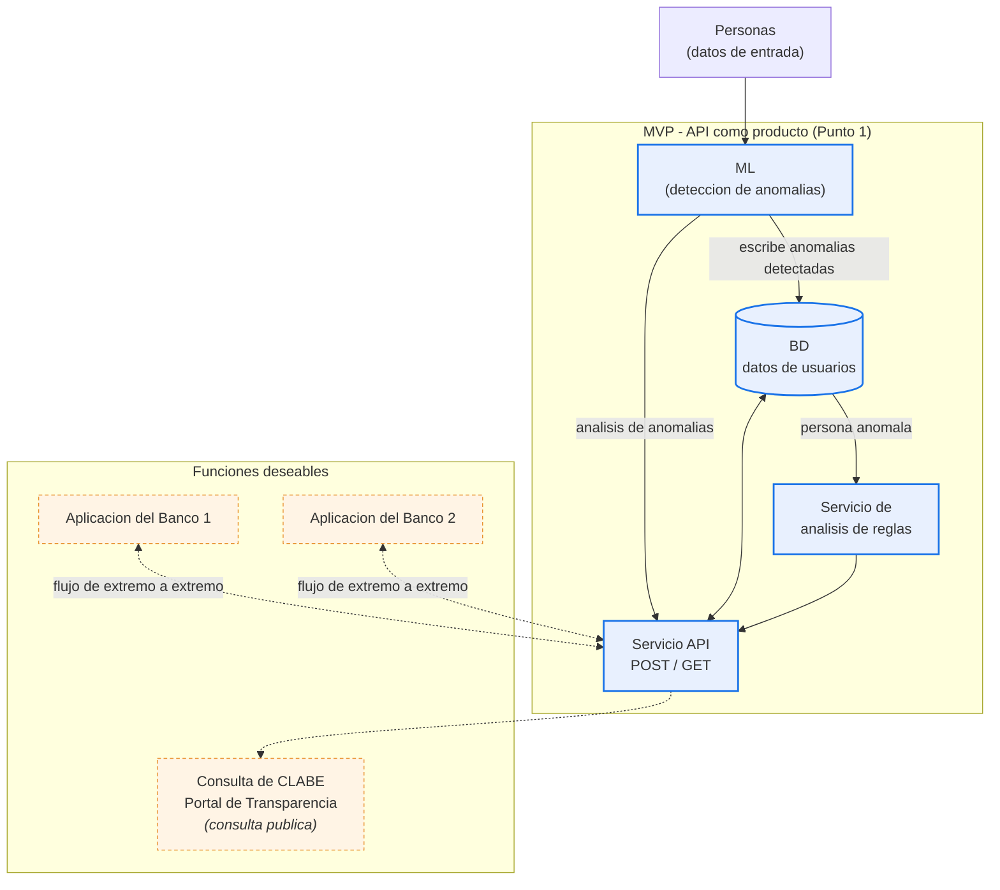

# Arquitectura de HackMTY

Este diagrama representa la arquitectura actual a alto nivel. El MVP central es una API como producto para el analisis de anomalias. Las interfaces bancarias y la consulta publica de CLABE son extensiones opcionales que se muestran para dar visibilidad al producto y orientar su evolucion.

## Flujo

- `Personas` son datos de entrada enviados a la implementacion de ML.
- ML detecta anomalias, las escribe en la base de datos y envia el analisis de anomalias al servicio API principal.
- La base de datos proporciona informacion sobre personas anomalas al servicio de analisis de reglas.
- El servicio de reglas y la base de datos respaldan la respuesta de la API.
- La API es la superficie principal del producto para el MVP.
- Las dos aplicaciones bancarias representan interfaces opcionales de extremo a extremo para distintos bancos y demuestran como el guard puede prevenir una operacion fraudulenta.
- La consulta publica de CLABE es un producto publico opcional conectado a la API.
