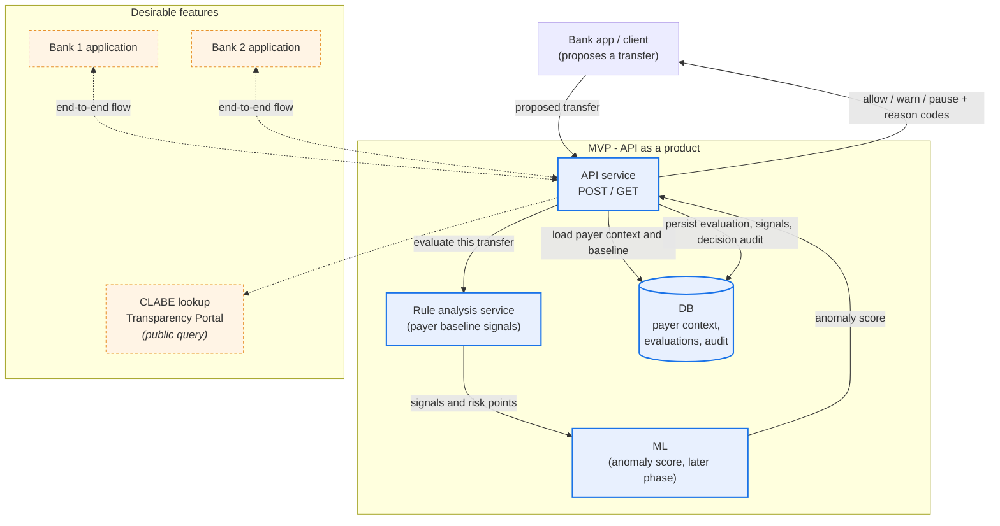

# HackMTY Architecture

This diagram shows the current high-level architecture. The core MVP is an
API as a product for transfer-intent anomaly analysis. Bank interfaces and the
public CLABE lookup are optional extensions, shown to give the product
visibility and to indicate where it can evolve.

The canonical flow is defined in
[`ADR-0001`](ADR-0001-canonical-mvp-architecture.md). The API is the entry
point; risk scoring is called inside the request, not run ahead of it.

## Flow

- A bank application or client proposes a transfer to the API. The API is the
  entry point for every request.
- The API loads the payer's context and behavioral baseline from the database.
- The rule analysis service evaluates **this transfer** against **this payer's**
  baseline and emits explainable signals with risk points.
- The ML component contributes an anomaly score. It is a later phase; the
  rule-based path works without it.
- The API persists the risk evaluation, its signals, and the decision audit,
  then returns `allow`, `warn`, or `pause` with reason codes before the
  customer confirms.
- The two bank applications are optional end-to-end interfaces that show how
  the guard can prevent a fraudulent operation.
- The public CLABE lookup is an optional public product connected to the API.

## Scope constraint

The system scores a **transfer**, not a person. It does not compute
person-level risk, receiver reputation, or "anomalous person" records. See
`docs/ai/knowledge/spei-intent-guard-data-model.md` for the entity model and
`docs/ai/engineers-discussion/HACKMTY-CONTEXT.md` section 6 for why reputation
and complaint signals were deliberately excluded.
