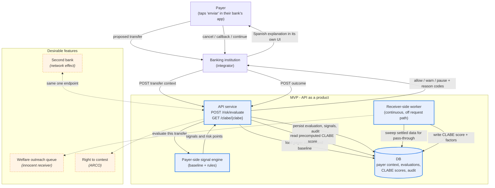

# HackMTY Architecture

High-level architecture for SPEI Intent Guard. The product is an **API that a
banking institution integrates**, backed by a continuous worker that maintains
receiver-side risk scores.

Canonical decision:
[`ADR-0002`](ADR-0002-bank-integrated-api-and-receiver-worker.md). Direction of
record: [`spei-guard-direction.md`](../ai/knowledge/spei-guard-direction.md).

## Request path (synchronous, sub-second)

1. The payer taps send in their bank's app. The bank is the integrator; the
   payer never talks to this API directly.
2. The bank POSTs transfer context: amount, beneficiary CLABE, the payer's
   recent history, session and device context, and MTU state.
3. The payer-side engine scores the payer's **own** behavior — recent MTU
   increase, beneficiary registered minutes ago, first transfer to it, amount
   above personal baseline, amount near the cap, tight sequencing between those
   events, low residual balance. Device, hour, and recent security changes are
   secondary context only.
4. The API reads the worker's **precomputed** score for the destination CLABE.
   This is a cache read, which is what keeps the call fast at rail scale.
5. Decision policy: one signal informs → `allow`, two → `warn`, three or more
   independent primary signals → `pause`. Secondary signals can never reach
   `pause` on their own.
6. The API returns the decision, reason codes, a Spanish explanation, the full
   signal breakdown, and measured latency.
7. The bank renders the warning in its own interface. The payer cancels,
   requests a verified callback, or continues deliberately.
8. The bank POSTs the outcome back, which feeds the registry and the metrics.

## Worker path (continuous, off the request path)

Sweeps settled transfer data for **pass-through**: funds arriving from many
distinct payers and leaving within minutes, with residual balance near zero.
That is the mule signature. A merchant's money rests and pays suppliers, which
is the discriminator that keeps a taquería from being flagged — see ADR-0002
section 5 for the weighting.

Writes a per-CLABE score with its contributing factors, decaying on tiered
windows. The worker is stateless and horizontally scalable; all per-CLABE state
lives in the database.

## What the product sells

- **Transparency.** The score decomposes into named rules with observed-versus-
  baseline values and a `ruleset_version`. A bank can show it, a payer can act
  on it, and a wrongly-scored account holder has something concrete to contest.
- **Ease of use.** One endpoint. No model for the bank to train, no new
  infrastructure. That is also the adoption incentive absent a mandate.

## Scope constraints

The system scores a **transfer** and an **account**, never a person. No names,
no RFC, no CURP, no protected attributes. A score informs the payer's decision;
it never blocks an account and never propagates as an instruction to a bank.
Queries are institution-authenticated and answered only in the context of a
pending transfer held by the caller, so the lookup cannot be used to test
whether a mule account is still clean. An innocent-receiver pattern routes to
welfare outreach, not restriction.

See [`spei-intent-guard-data-model.md`](../ai/knowledge/spei-intent-guard-data-model.md)
for the entity model and
[`HACKMTY-CONTEXT.md`](../ai/engineers-discussion/HACKMTY-CONTEXT.md) section 6
for the privacy reasoning.
