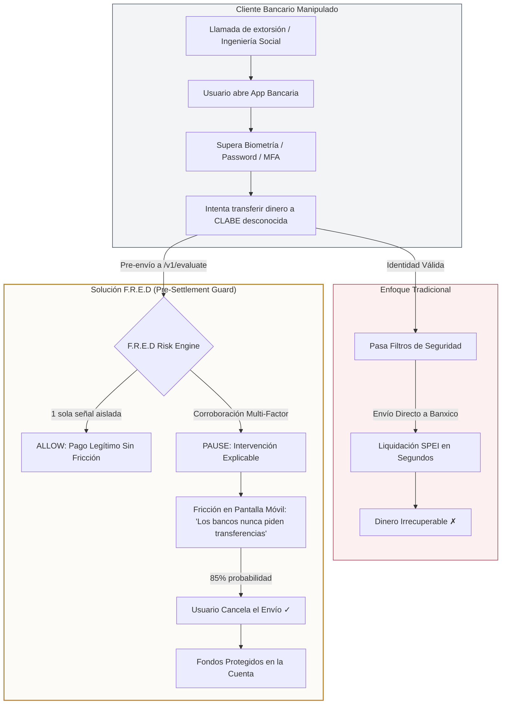
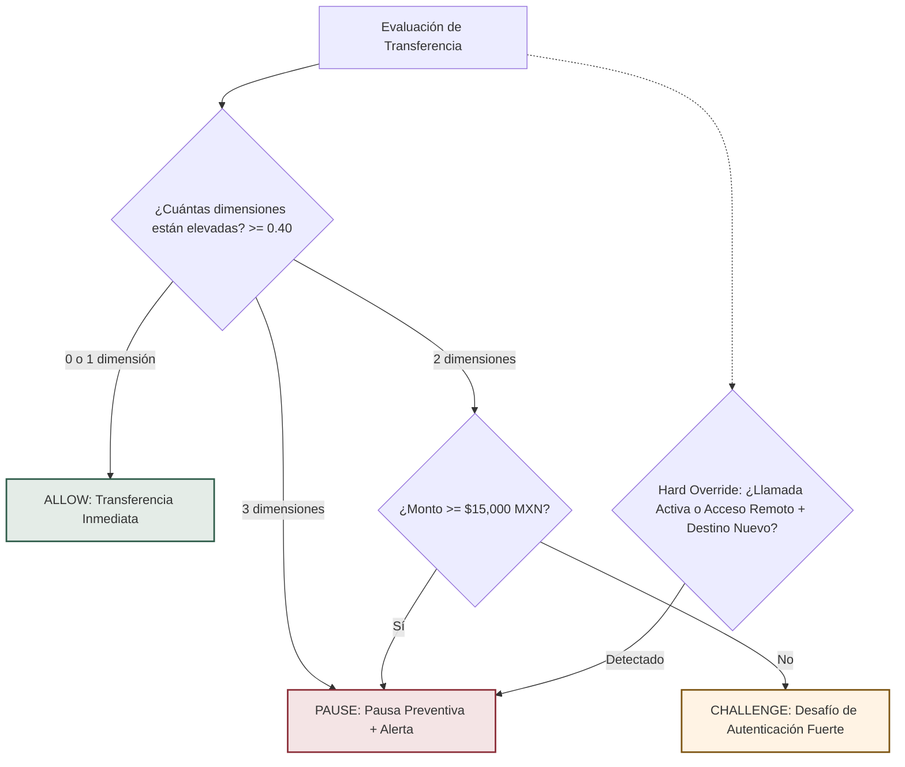
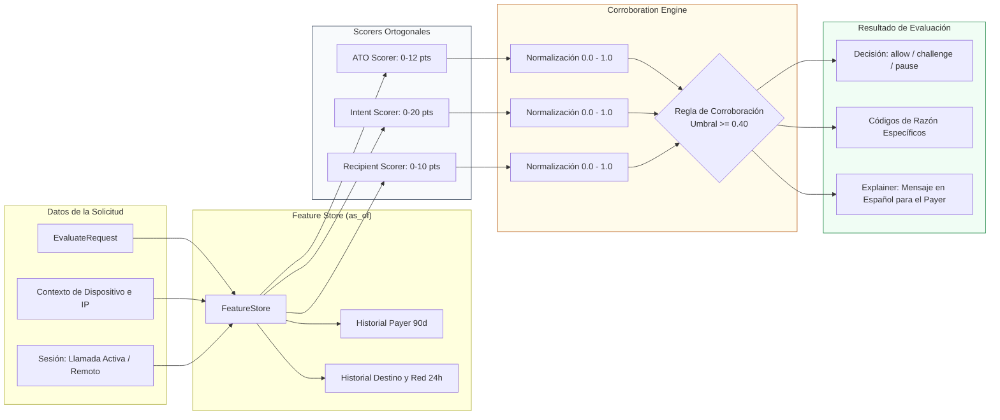
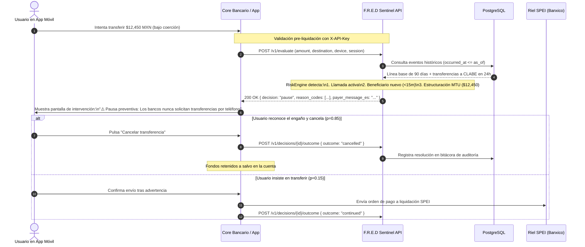
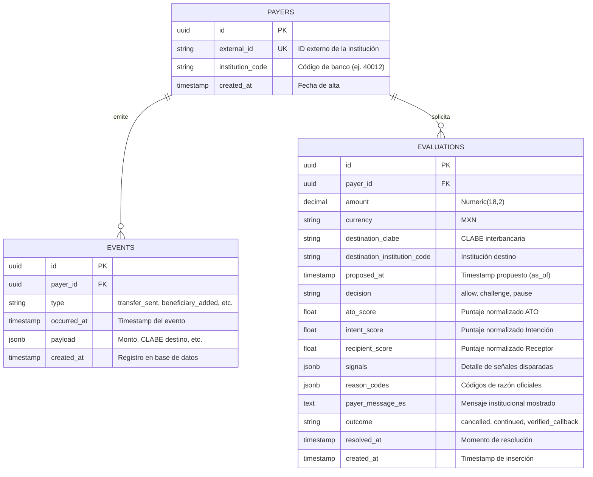

# Arquitectura de F.R.E.D (Project Sentinel)

Este documento detalla la arquitectura de **F.R.E.D (Fraude Detection Engine / Project Sentinel)** desde dos perspectivas complementarias:
1. **Perspectiva de Solución y Producto (API as a Product)**: Cómo se inserta en el ecosistema financiero mexicano (SPEI / Banco de México), resolviendo la brecha de pagos autorizados bajo engaño (Authorized Push Payment - APP) antes de la liquidación irreversible.
2. **Perspectiva de Ingeniería de Software**: La estructura técnica de servicios desacoplados, contratos de API, almacenamiento temporal relativo (`as_of`), motor de corroboración ortogonal y modelos de persistencia.

---

## 1. Perspectiva de Producto y Solución

### 1.1 El Ecosistema SPEI y la Ventana de Intervención

En México, las transferencias SPEI liquidan en cuestión de segundos y son legalmente irreversibles. Los sistemas tradicionales de prevención de fraude solo validan la identidad del usuario (*"¿es el titular legítimo?"*). F.R.E.D responde a la pregunta crítica: ***"¿el usuario autenticado está siendo manipulado o coaccionado en este instante?"***.



---

### 1.2 Modelo Operativo: API as a Product (Continuous Risk Serving)

F.R.E.D opera bajo un modelo de desacoplamiento entre el **análisis continuo** y el **consumo de señales precalculadas**:
- **Continuous Worker**: Observa continuamente las operaciones y señales de red por CLABE receptora (fan-in, antigüedad, estructuración).
- **Persistent Risk Store**: Materializa el estado de riesgo histórico y de red.
- **Serving API**: Responde en **< 4 ms (p95)** al banco emisor durante el intento de transferencia sin disparar análisis batch pesados en el momento crítico.

```mermaid
flowchart LR
    subgraph Ingestion ["1. Canal de Telemetría Continua"]
        SPEI_Stream[Eventos Transaccionales SPEI] -->|Streaming / Batch| Worker[Continuous Risk Worker]
        Bank_Events[Eventos Bancarios: Límites, Dispositivos] -->|POST /v1/events| Worker
    end

    subgraph Core ["2. F.R.E.D Engine & Risk State"]
        Worker -->|Actualización Continua| DB[(Persistent Risk Store / PostgreSQL)]
        DB -->|Líneas Base y Red Receptora| Engine[Risk Engine Corroborator]
    end

    subgraph Serving ["3. API as a Product (Pre-Settlement)"]
        MobileApp[Banca Móvil Institucional] -->|POST /v1/evaluate (as_of)| API[F.R.E.D Serving API]
        API --> Engine
        Engine -->|Decisión + Mensaje en Español| API
        API -->|allow / challenge / pause| MobileApp
        MobileApp -->|POST /v1/decisions/{id}/outcome| API
    end

    style Core fill:#fff9f0,stroke:#b68235,stroke-width:2px
    style Serving fill:#f0fdf4,stroke:#2f5d4a,stroke-width:2px
    style Ingestion fill:#f8fafc,stroke:#64748b,stroke-width:1px
```

---

### 1.3 Matriz de Decisión y Fricción Proporcional

F.R.E.D aplica fricción graduada para garantizar **cero falsos positivos en comercios legítimos** (PyMEs) mientras intercepta el fraude por coacción.



---

## 2. Perspectiva de Ingeniería de Software

### 2.1 Topología de Servicios y Red en Producción

La infraestructura se ejecuta en contenedores Docker independientes bajo un proxy inverso HTTPS gestionado por Caddy en `sixsevencitos.tech`.

```mermaid
graph TB
    Internet((Internet / Clientes)) -->|HTTPS :443| Caddy[Caddy Reverse Proxy]

    subgraph DockerHost ["Servidor Host Docker"]
        Caddy -->|/v1/*, /health, /docs| API_Svc[apps/api :8000]
        Caddy -->|/sim/*| Gen_Svc[apps/generator :8001]
        Caddy -->|/* (UI Estática)| UI_Svc[apps/ui :3000]

        API_Svc -->|SQLAlchemy 2.0 / Pool| Postgres[(PostgreSQL DB :5432)]
        Gen_Svc -->|HTTP REST / X-API-Key| API_Svc
        
        subgraph EngineInternals ["Sentinel API Internals"]
            API_Svc --> FeatureStore[FeatureStore (as_of temporal query)]
            API_Svc --> RiskEngine[RiskEngine]
            RiskEngine --> Explainer[Explainer / Gemini Fallback]
        end
    end

    style DockerHost fill:#fafaf9,stroke:#78716c,stroke-width:2px
    style EngineInternals fill:#fdfbf7,stroke:#b68235,stroke-width:1px
    style Postgres fill:#e2e8f0,stroke:#334155,stroke-width:2px
```

---

### 2.2 Pipeline Interno del Motor de Riesgo (`RiskEngine`)

El motor de evaluación analiza **tres dimensiones ortogonales** que se combinan mediante una regla de corroboración lógica, nunca mediante una suma ponderada lineal (para evitar que señales no relacionadas se sumen artificialmente).



---

### 2.3 Diagrama de Secuencia End-to-End

Muestra la interacción completa desde que el banco envía la solicitud previa a la liquidación hasta que el cliente toma una acción tras la pausa preventiva.



---

### 2.4 Modelo Entidad-Relación de Persistencia

El modelo de datos almacena eventos bancarios inmutables y el historial de evaluaciones para trazabilidad y entrenamiento continuo.



---

## 3. Resumen de Dimensiones y Señales del Motor

| Dimensión | Puntos Máximos | Señales Detectadas |
|---|---|---|
| **Account Takeover (ATO)** | 12 pts | • Dispositivo nunca antes visto (+4)<br>• IP de alto riesgo o salto geográfico (+3)<br>• Cambio de credenciales en ≤24h (+3)<br>• Transacción en horario nocturno 00:00–05:00 (+2) |
| **Payer Intent (Intención)** | 20 pts | • Monto ≥ 2x el máximo en 90 días (+4)<br>• Drenado de saldo ≥ 80% (+4)<br>• Beneficiario registrado hace ≤ 15 minutos (+4)<br>• Velocidad inusual de transferencias en 1h (+4)<br>• Estructuración bajo umbrales regulatorios MTU (+4)<br>• Incremento de límite operativo hace ≤ 60 min (+4)<br>• Llamada telefónica activa durante la sesión (+4)<br>• Sesión con software de acceso remoto o pantalla compartida (+5) |
| **Recipient Network (Destino)** | 10 pts | • Destinatario visto por primera vez (+3)<br>• Institución receptora no vista previamente (+2)<br>• Beneficiario registrado hace ≤ 60 min (+2)<br>• Fan-in anómalo: ≥ 3 ordenantes distintos transfiriendo a la misma CLABE en ≤ 24h (+4) |

---

## 4. Garantías de Privacidad y Regulación

- **Zero PII Leakage**: No se transmiten ni almacenan nombres, números de tarjeta, contactos, audios ni capturas de pantalla.
- **Explainability First**: Toda decisión de pausa (`pause`) incluye códigos de razón auditables (`reason_codes`) y una explicación clara para el cliente.
- **Temporal Reproducibility**: Todas las reglas operan sobre el parámetro `as_of`, garantizando auditorías reproducibles frente a comisiones reguladoras (CNBV / Banxico / CONDUSEF).
